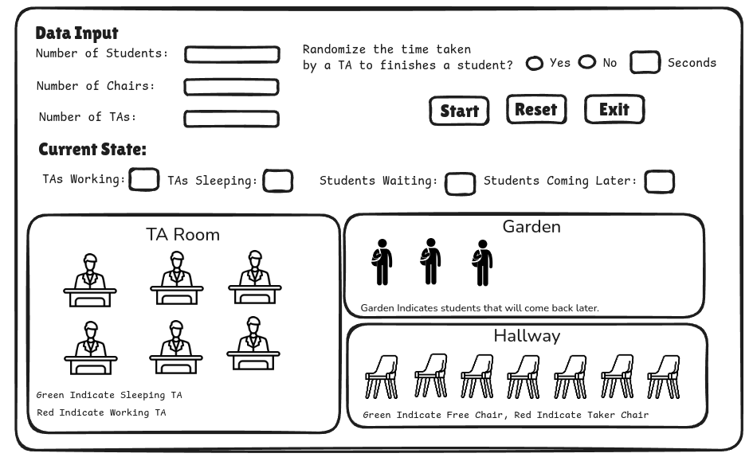
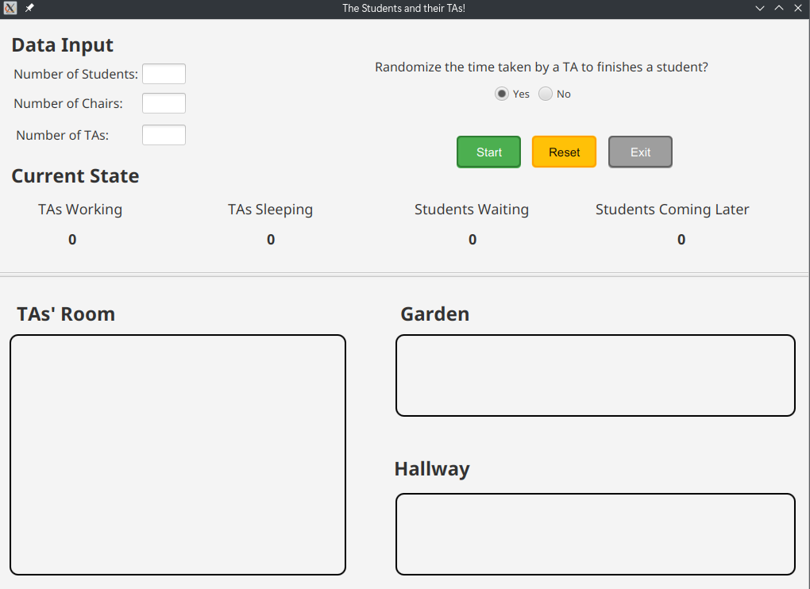
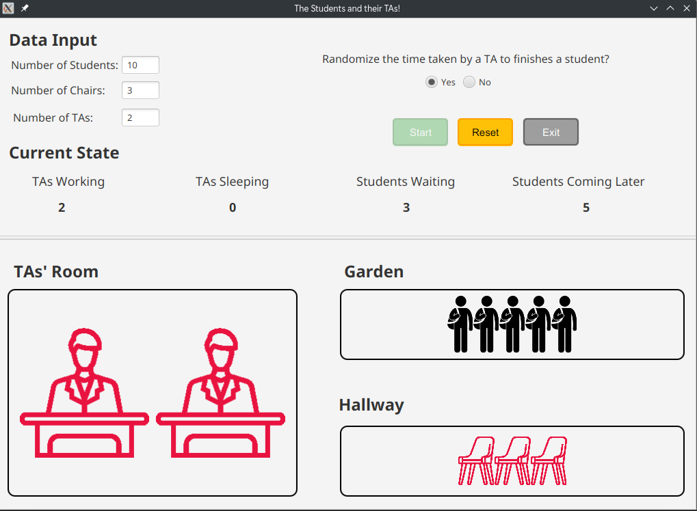
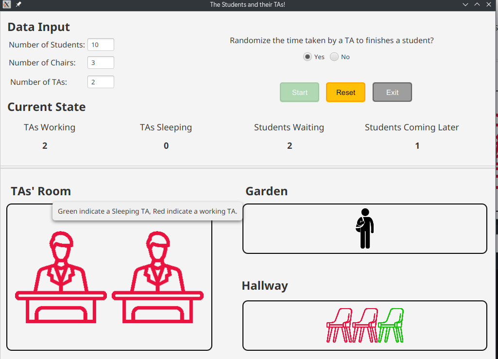
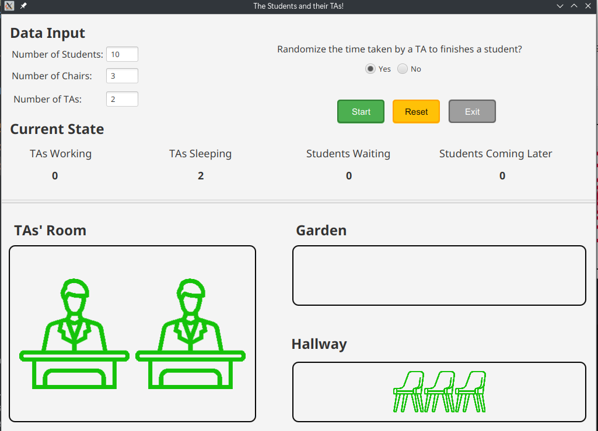

# Sleeping Teaching Assistant Project Documentation

***

## Table of Contents

- [Project Description](#project-description)
- [Problem Specifications](#problem-specifications)
  - [Inputs](#inputs)
  - [Outputs](#outputs-real-time-updates)
- [Tools and Technologies](#tools-and-technologies)
- [Team Members & Roles](#team-members--roles)
- [Project Structure](#project-structure)
- [UI Design](#ui-design)
- [Snapshots](#snapshots)
- [How to Run](#how-to-run)

***

## Project Description

The Sleeping Teaching Assistant (TA) problem simulates the coordination of activities between students and teaching assistants during office hours in a university's computer science department.

The solution models the following:

- Students: Represented as threads attempting to seek help from a TA.
- TAs: Represented using semaphores who either assist students or sleep when no students are waiting.
- Waiting Chairs: Represented using semaphores, allowing students to queue when a TA is busy. If no chairs are available, students leave and try again later (sleep).

***

## Problem Specifications

Students who need help follow this process:

- If a TA is available, they wake up the TA and begin the session.
- If no TA is available but a chair is free, they sit and wait.
- If no chair is free, they leave and try again later.

### Inputs

- Number of Students: Total number of students seeking help.
- Number of Chairs: Number of waiting chairs in the hallway.
- Number of TAs: Number of available teaching assistants.

> There is an optional input in the GUI, which is the wait time of the TA to finish a session with a student.

#### Outputs (Real-time Updates)

- Number of TAs working.
- Number of TAs sleeping.
- Number of students waiting on chairs.
- Number of students who left to return later.

***

## Tools and Technologies

- **Java Threads** for concurrency.
- **Semaphores** for synchronization.
- **JavaFX** for GUI.
- **Scene Builder** for designing the GUI.
- **Excalidraw** for designing the UI.

***

## Team Members & Roles

- Mohammed Khalid: GUI Development.
- Mohammed Reda: Core Logic Development.
- Mohammed Medhet: UI Design.
- Mahmoud Talaat: Core Logic Development.
- Mostafa Abdo: GUI Development.
- Mostafa Mokhtar: Documentation.

***

## Project Structure

The following section explains the structure and logic of the code:

### `App.java`

The main class of the project, responsible for launching the GUI.

### `Student.java`

The Student class represents a student thread that seeks help from a TA.

### `Services.java`

The Services class is responsible for managing the services provided by the TA and Chairs, including the following methods:

- `takeUserInput`: Takes the user input and initializes the program's semaphores.
  - Note: there is an overload method that takes the input from the CLI for testing purposes.
- `createStudentThreads`: Creates student threads.
- `getInfo`: Returns the current state of the simulation.
- `displayInfo`: Used for testing purposes to display the current state of the simulation in the CLI.
- `countRunningStudents`: Returns the number of students threads currently running.
- `isStudentThreadRunning`: Checks if a student thread is running.
- `getChairs`: Returns the chair's semaphore.
- `getTAs`: Returns the TA's semaphore.

### `GUI.Main.java`

The main class for the GUI, responsible for launching the GUI.

### `GUI.Controller.java`

The controller class for the GUI, responsible for handling the GUI's logic.

### `GUI.Controllers.*.java`

The controller classes for the different complex components of the GUI.

***

## UI Design



***

## Snapshots

#### Entry State



#### Initial State



##### Mid-State



##### Final State



***

## How to Run

Clone the repository:

```bash
git clone https://github.com/mrreda1/SleepingTA
```

Navigate to the project directory:

```bash
cd SleepingTA
```

Run the project:

```bash
./gradlew run
```

***
